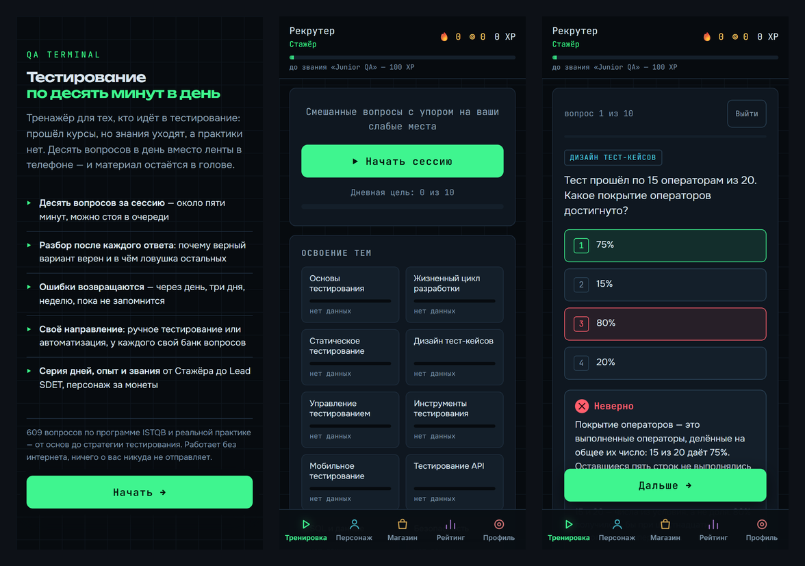

Курс QA Studio · 9 месяцев практики на реальных продуктах · собственное приложение для тестировщиков

&nbsp;

---

##  QA Terminal — мой проект

Тренажёр для начинающих тестировщиков: десять вопросов в день, разбор каждого ответа, повтор ошибок, подготовка к ISTQB. Работает в браузере и на телефоне, без регистрации.

**▶ [Открыть приложение](https://qa-terminal.pages.dev)** · 📄 [Кейс: как я его тестирую](https://github.com/neffrit/qa-terminal-case)

Код приложения пишет ИИ-агент. Моя роль — владелец продукта и тестировщик: ставлю задачи, пишу требования, проверяю каждую версию и решаю, готова ли она к выкладке.

---

##  Что умею

| Направление | Что делаю |
|---|---|
| Тест-дизайн | чек-листы, тест-кейсы, баг-репорты с шагами, скриншотами и видео |
| Веб | DevTools, HTTP, кроссбраузерность, проверка вёрстки по Figma, Charles |
| Мобильные | эмуляторы Android Studio и Xcode, TestFlight, трафик через Charles |
| API | ручные проверки в Postman и Swagger |
| Данные | SQL-запросы в PostgreSQL: SELECT, JOIN, GROUP BY |
| Процессы | Scrum, Jira, Яндекс Трекер, TestIT, Qase.io, Git |

##  Инструменты

#### Тестирование API и интеграций
<table width="100%">
  <tr align="center">
    <td> Postman</td>
    <td> Rest</td>
    <td> Soap</td>
    <td> Kafka</td>
    <td> Swagger</td>
    <td> Docker</td>
  </tr>
</table>

#### Тестирование Web и мобильных приложений
<table width="100%">
  <tr align="center">
    <td> Figma</td>
    <td> HTTP</td>
    <td> HTML</td>
    <td> CSS</td>
    <td> JavaScript</td>
    <td> PHP</td>
    <td> Firebase</td>
    <td> Android Studio</td>
    <td> Charles</td>
  </tr>
</table>

#### Автотесты
<table width="100%">
  <tr align="center">
    <td> Cypress</td>
    <td> Selenium</td>
    <td> PyTest</td>
    <td> GitLab</td>
    <td> GitHub</td>
    <td> VS Code</td>
    <td> Python</td>
  </tr>
</table>

#### Базы данных
<table width="100%">
  <tr align="center">
    <td> Metabase</td>
    <td> MySQL</td>
    <td> PostgreSQL</td>
    <td> DBeaver</td>
    <td> MongoDB</td>
  </tr>
</table>

#### Логи и мониторинг
<table width="100%">
  <tr align="center">
    <td> Kibana</td>
    <td> Sentry</td>
    <td> Grafana</td>
    <td> Jaeger</td>
    <td> Bash</td>
  </tr>
</table>

##  Учусь

Автоматизация тестирования — следующий шаг. Учебные проекты с курса:
- [Python-Pytest-Requests](https://github.com/neffrit/Python-Pytest-Requests) — API-тесты на Python
- [cypressJS](https://github.com/neffrit/cypressJS) — UI-тесты на Cypress
- [tg_json](https://github.com/neffrit/tg_json) — Telegram-бот для проверки JSON
---

##  Практика

**testCloud (практика от QA Studio), апрель — декабрь 2025**
- **auto.ae** — сервис объявлений об авто: тестирование личного кабинета, кроссбраузерность, API через Swagger и Postman
- **Chat Net** — корпоративный мессенджер для iOS и Android: 150+ проверок, 12 найденных дефектов, 9 баг-репортов

##  Образование

